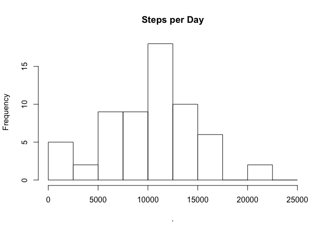

# Reproducible Research: Peer Assessment 1

## Loading and preprocessing the data

```r
activity <- read.csv(file = 'activity.csv', stringsAsFactors = FALSE)

require(magrittr)
```

```
## Loading required package: magrittr
```

```r
require(dplyr)
```

```
## Loading required package: dplyr
## 
## Attaching package: 'dplyr'
## 
## The following objects are masked from 'package:stats':
## 
##     filter, lag
## 
## The following objects are masked from 'package:base':
## 
##     intersect, setdiff, setequal, union
```

## What is mean total number of steps taken per day?

The prompt says that we can `ignore missing values`.  I am taking that to mean that we can `na.rm` when summing by day.

### steps per day

```r
per_day <- activity %>%
  dplyr::group_by(date) %>%
  dplyr::summarize(
    avg_steps = sum(steps, na.rm = TRUE)
  ) 

per_day
```

```
## Source: local data frame [61 x 2]
## 
##          date avg_steps
##         (chr)     (int)
## 1  2012-10-01         0
## 2  2012-10-02       126
## 3  2012-10-03     11352
## 4  2012-10-04     12116
## 5  2012-10-05     13294
## 6  2012-10-06     15420
## 7  2012-10-07     11015
## 8  2012-10-08         0
## 9  2012-10-09     12811
## 10 2012-10-10      9900
## ..        ...       ...
```

### histogram

```r
per_day$avg_steps %>% 
  hist(
    breaks = seq(0, 25000, 2500), 
    main = 'Steps per Day'
  )
```

 

### mean

```r
per_day$avg_steps %>% mean()
```

```
## [1] 9354.23
```

### median

```r
per_day$avg_steps %>% median()
```

```
## [1] 10395
```

## What is the average daily activity pattern?


```r
per_interval <- activity %>%
  dplyr::group_by(interval) %>%
  dplyr::summarize(
    avg_steps = mean(steps, na.rm = TRUE)
  )

per_interval
```

```
## Source: local data frame [288 x 2]
## 
##    interval avg_steps
##       (int)     (dbl)
## 1         0 1.7169811
## 2         5 0.3396226
## 3        10 0.1320755
## 4        15 0.1509434
## 5        20 0.0754717
## 6        25 2.0943396
## 7        30 0.5283019
## 8        35 0.8679245
## 9        40 0.0000000
## 10       45 1.4716981
## ..      ...       ...
```


```r
plot(
  per_interval$interval, per_interval$avg_steps, type='l',
  main = 'Average Steps per 5 min Daily Interval', 
  xlab = 'Interval', ylab = 'Average Steps', 
  col = 'hotpink', lwd = 2,
)
```

 

### largest average interval
The interval with the largest (maximum) number of steps is interval **835**, with 206.2 steps.

```r
per_interval %>% arrange(-avg_steps)
```

```
## Source: local data frame [288 x 2]
## 
##    interval avg_steps
##       (int)     (dbl)
## 1       835  206.1698
## 2       840  195.9245
## 3       850  183.3962
## 4       845  179.5660
## 5       830  177.3019
## 6       820  171.1509
## 7       855  167.0189
## 8       815  157.5283
## 9       825  155.3962
## 10      900  143.4528
## ..      ...       ...
```

## Imputing missing values

### total number of missing values
There are 2304 missing (NA) rows.


```r
activity$steps %>% is.na() %>% sum()
```

```
## [1] 2304
```

### devise and create an imputation strategy


```r
ma <- function(x, n = 5){
  stats::filter(x, rep(1/n, n), sides = 1)
}

per_day$rolling_avg <- ma(per_day$avg_steps, 3)
per_day$rolling_avg <- ifelse(per_day$rolling_avg %>% is.na(), 0, per_day$rolling_avg)
per_day <- per_day %>%
  ungroup() %>%
  rowwise() %>%
  mutate(
    avg_steps = avg_steps %>% as.numeric(),
    imputed_steps = ifelse(
      avg_steps == 0, rolling_avg, avg_steps
    )
  )

per_day
```

```
## Source: local data frame [61 x 4]
## Groups: <by row>
## 
##          date avg_steps rolling_avg imputed_steps
##         (chr)     (dbl)       (dbl)         (dbl)
## 1  2012-10-01         0       0.000         0.000
## 2  2012-10-02       126       0.000       126.000
## 3  2012-10-03     11352    3826.000     11352.000
## 4  2012-10-04     12116    7864.667     12116.000
## 5  2012-10-05     13294   12254.000     13294.000
## 6  2012-10-06     15420   13610.000     15420.000
## 7  2012-10-07     11015   13243.000     11015.000
## 8  2012-10-08         0    8811.667      8811.667
## 9  2012-10-09     12811    7942.000     12811.000
## 10 2012-10-10      9900    7570.333      9900.000
## ..        ...       ...         ...           ...
```

### histogram

```r
per_day$imputed_steps %>% 
  hist(
    breaks = seq(0, 25000, 2500), 
    main = 'Steps per Day'
  )
```

 

### mean

```r
per_day$imputed_steps %>% mean()
```

```
## [1] 10050.9
```

### median

```r
per_day$imputed_steps %>% median()
```

```
## [1] 10395
```

### discussion
My strategy for dealing with missing data is not very agressive - my general theory is that days with all NAs/missing data are almost certainly a mistake in the data (having owned a fitbit, those are probably days you forgot to wear it!).

I computed a 3 day trailing average, and on those days with no steps, I replace the missing days with the trailing average.  This mainly impacts the lower tail of the distribution - rather than having some days that are zero, those days now look more like their neighbors, in terms of step count.

This brings the mean up fairly significantly, from ~9,350 to ~10,050. The median, however, is not changed - my imputed data set still has a median step count of 10,395.  I think that's because all of the days that I imputed were already below the median, and while they moved up, no days moved up _past_ the median (and no days were added) meaning that the median value remained unchanged.

## Are there differences in activity patterns between weekdays and weekends?

### create new variable

```r
by_weekdays <- activity %>%
  mutate(
    is_weekday = weekdays(date %>% as.Date()),
    is_weekday = ! is_weekday %in% c('Saturday', 'Sunday'),
    is_weekday = ifelse(is_weekday, 'Weekdays', 'Weekends')
  ) %>%
  group_by(is_weekday, interval) %>%
  dplyr::summarize(
    avg_steps = mean(steps, na.rm = TRUE),
    n = n()
  )

by_weekdays
```

```
## Source: local data frame [576 x 4]
## Groups: is_weekday [?]
## 
##    is_weekday interval avg_steps     n
##         (chr)    (int)     (dbl) (int)
## 1    Weekdays        0 2.3333333    45
## 2    Weekdays        5 0.4615385    45
## 3    Weekdays       10 0.1794872    45
## 4    Weekdays       15 0.2051282    45
## 5    Weekdays       20 0.1025641    45
## 6    Weekdays       25 1.5128205    45
## 7    Weekdays       30 0.7179487    45
## 8    Weekdays       35 1.1794872    45
## 9    Weekdays       40 0.0000000    45
## 10   Weekdays       45 1.8461538    45
## ..        ...      ...       ...   ...
```

### make a panel plot

```r
require(ggplot2)
```

```
## Loading required package: ggplot2
```

```r
ggplot(
  data = by_weekdays,
  aes(
    x = interval,
    y = avg_steps,
    color = is_weekday
  )
) +
geom_line() +
theme_bw() +
facet_grid(is_weekday ~ .)
```

 

Activity starts earlier in the day on weekdays, and is more concentrated in the earlier intervals.  Weekend activity is much more frequent between intervals 1000 and 1500.
